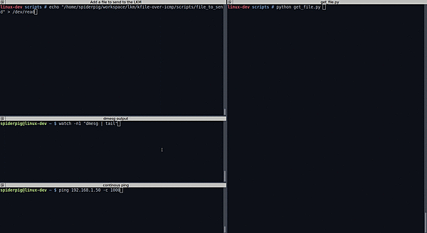

# __kfile-over-icmp__

> **Note**: This LKM was developed using linux kernel version *4.4.10* and *4.98.13*. Should you have problems compiling this module, please check for your kernel version first.

_kfile-over-icmp_ is a loadable kernel module for stealth sending of files over ICMP communication.

## __Usage__
```sh
$ git clone https://github.com/spiderpig1297/kfile-over-icmp.git
$ cd kfile-over-icmp
$ make
$ make install
```
___

Once installed, the module registers a character device from which it reads the paths of the files to send.
Run `dmesg` to retrieve the major number of the device, and then create a node to it using `mknod`:

```sh
$ dmesg | tail

[15132.935862] kfile-over-icmp: LKM loaded
[15132.935864] kfile-over-icmp: registered netfilter hook
[15132.935867] kfile-over-icmp: succesfully registered character device. major: 243

$ mknod /dev/readfile c <MAJOR_GOES_HERE> 0
```

In order to send a file over ICMP, write its (absolute!) path to our newly-created device:

```sh
$ echo "/file/to/send/ > /dev/readfile
```

__From now on, once an ICMP-request (ping) packet will reach the machine, the module will inject the file's data on the ICMP-reply packet.__

For more information, see [How It Works](#how-it-works).

___ 

To uninstall the module, run:

```sh
$ make remove
```

## Example



- __Top-left window__ - tells the module (using our character device) to send the file found in */home/spiderpig/workspace/lkm/kfile-over-icmp/scripts/file_to_send*.
- __Middle-left window__ - shows `dmesg` output.
- __Bottom-left window__ - continuous ping which triggers the sending of the file.
- __Right window__ - python script for reading the ICMP packets and saving the file. Found in [scripts/get_file.py](scripts/get_file.py).

## __How It Works__
___ 

- [Why an LKM?](#why-an-lkm)
- [Mangling outgoing packets](#mangling-outgoing-packets)
- [Injecting data to ICMP packets](#injecting-data-to-icmp-packets)
- [Reading user-space files](#reading-user-space-files)
___ 
### Why an LKM?

You probably ask yourselves why to implement this complicated logic as a kernel module. It is harder to implement and it can certainly be implemented in user-mode by using _netfilter_'s user-mode functionality.

Well, there are few reasons why I chose to implement it as an LKM:
- It is by far more fun and challenging. Implementing this module requires complicated mechanisms such as injecting data to ICMP packets and reading-and-splitting-to-chunks files from the user-space.
- It is by far more stealth than a user-mode program. There is no network-related system-command (`iptables`, `netstat`, etc) in the world that will ever be able to know that a driver listens on ICMP and injects data on the replies.
- Since we are dealing with files from the kernel, each file's metadata is left untouched. It means that reading the file doesn't change it modification time (mtime) nor its access time (atime) or creation time (ctime).

### Mangling outgoing packets

The module uses _netfilter_ to intercept every outgoing packet in the system.

From netfilter's documentation:

    netfilter is a set of hooks inside the Linux kernel that allows kernel modules to register callback functions with the network stack. A registered callback function is then called back for every packet that traverses the respective hook within the network stack.

netfilter offers a number of different places where a user can place his hooks:

    --->[1]--->[ROUTE]--->[3]--->[4]--->
                 |            ^
                 |            |
                 |         [ROUTE]
                 v            |
                [2]          [5]
                 |            ^
                 |            |
                 v            |

    [1] NF_IP_PER_ROUNTING — triggered by any incoming traffic very soon after entering the network 
                             stack. This hook is processed before any routing decisions have been made 
                             regarding where to send the packet.
    [2] NF_IP_LOCAL_IN —     triggered after an incoming packet has been routed if the packet is destined 
                             for the local system.
    [3] NF_IP_FORWARD —      triggered after an incoming packet has been routed if the packet is to be 
                             forwarded to another host.
    [4] NF_IP_POST_ROUTING — triggered by any outgoing or forwarded traffic after routing has taken place 
                             and just before "hitting the wire".
    [5] NF_IP_LOCAL_OUT —    triggered by any locally created outbound traffic as soon it hits the network 
                             stack.

The module places an hook on `NF_IP_POST_ROUTING` in order to intercept every outgoing packets, meaning that
the callback will be called for every packet sent from the machine, with the packet as its argument.

Then the module checks whether the packet's protocol is ICMP and its type is ICMP-reply. Every packet that
doesn't meet the requirements is ignored and left untouched. Every packet that meets the requirements will
later be injected with the file's data.

All the above logic is implemented in `net/netfilter.c`.

### Injecting data to ICMP packets

This is the time to admit that this title is a bit misleading, as we are injecting data __on top__ of ICMP packets (spoiler!), and not __into__ ICMP packets.

[ICMP](https://en.wikipedia.org/wiki/Internet_Control_Message_Protocol) packets are very narrowed in places
where we can inject our data. To refresh our memory, here is the ICMP header layout taken from its [RFC](https://tools.ietf.org/html/rfc792):

    Echo or Echo Reply Message

     0                   1                   2                   3
     0 1 2 3 4 5 6 7 8 9 0 1 2 3 4 5 6 7 8 9 0 1 2 3 4 5 6 7 8 9 0 1
    +-+-+-+-+-+-+-+-+-+-+-+-+-+-+-+-+-+-+-+-+-+-+-+-+-+-+-+-+-+-+-+-+
    |     Type      |     Code      |          Checksum             |
    +-+-+-+-+-+-+-+-+-+-+-+-+-+-+-+-+-+-+-+-+-+-+-+-+-+-+-+-+-+-+-+-+
    |           Identifier          |        Sequence Number        |
    +-+-+-+-+-+-+-+-+-+-+-+-+-+-+-+-+-+-+-+-+-+-+-+-+-+-+-+-+-+-+-+-+
    |     Data ...
    +-+-+-+-+-
    
As we can see, the ICMP header is very small. If its not enough, its data must be the same between the reply and request packets, otherwise each side won't treat the packet as valid (hence won't print the famous `64 from 192.168.1.1 ...` output).

Since injecting our data on one of the above fields is not possible without causing anomaly in both sides,
we have to find another way. 

What if we will inject our data __after__ the end of the ICMP layer?

A quick research shows that this is possible.


As you can see in the picture, our data is inserted on top of the ICMP layer, without creating any anomaly in the packet. Also, wireshark parses that as a padding layer (not seen in the picture).

So, whenever the module identifies an outgoing ICMP-reply packet, it shoves the desired payload after the ICMP layer of the packet. The method of injecting payload as a padding layer has several advantages:
- __The data of both the ICMP requests and ICMP replies stays the same__, maintainig the RFC requirements and avoiding possible anomalies.
- Since we are not updating the size of the packet in the IP header (`tot_len`), __one can almost certainly
assume that no one will ever know that the payloads exists__. Most of the services or servers reads the _*tot_len*_ field to know how much more data they need to read. Of course that advanced systems such as IDS/IPS or any other DPI (Deep Packet Inspection) systems will probably recognize that anomaly, but we can assume that we will not encounter them very often.
- __This implementation is simpler__, needing only to add data and not to modify existing headers (except from the checksum).

Each time that netfilter's hook is called, it provides the relevant `sk_buff`. `sk_buff`, or "socket buffer" is the most fundamental data structure in the Linux networking code. Every packet sent or received is handled using this data structure. is the represntation of a socket used widely across the kernel. The `sk_buff` provides all kinds of information on the packet, including its headers and data.

By using the function `skb_data_put` one can inject its own data into the skb, which will later be sent over the network. 

All the logic of reading (and splitting) files and providing the data to the netfilter hook is implemented in `net/generate_payload.c`.

### Reading user-space files

Dealing with files from inside the kernel is considered by many as a bad practice (and for some by a [__very__](http://lkml.iu.edu/hypermail/linux/kernel/0005.3/0061.html) bad one). 

The main reason for that consensus is that the kernel is the one reponsible for tranlsating logical I/O (e.g user-space files) to physical I/O (e.g physical location on the disk), and performing logical I/O operations from within the kernel is weird and involves many edge-cases, and may even result in a kernel panic.

Most of the times - this is true. If a kernel module should get information from the user-space, the common way is to register a device and use _ioctl_ to give it information. But as our goal is to secretly read files from the user, it is inevitable for us to perform file I/O operations from within the kernel.

So, how it is done?

As dealing with files from the kernel is a bad practice, there is very little information on the internet regarding to that topic. The main source I used while writing this module is the kernel's source-code, with the help of fractions of stackoverflow threads.

The module uses the functions `filp_open` and `vfs_read` to open and read files respectively.
It then splits the files to chunks with a fixed size (defined in the code), which will later be sent on top of our ICMP packets.

The main issue with `vfs_read` is that it expects to save the output in a user-space buffer. In order to overcome this requirement, one should change the FS the `KERNEL_DS`, telling the kernel's memory-checking mechanism to expect a kernel-space buffer. Newer kernel versions have introduced the functions `kernel_read` and `kernel_write`, which does that fs dance within them and saving if from the caller. Generally, it is perferred to use these function, but it didn't work in this case :(

I suspect that `kernel_read` had failed due to the fact that modern filesystems (such as ext4 which I use) define `filp->f_op->read` to be `NULL`. Although it does supports `filp->f_op->read_iter`, and although it should be abstract to the caller which one of this functions is implemented, `kernel_read` _de facto_ fails from an unknown reason (actually it fails with `-EINVAL` but I have no idea why).

## Testing

- The module was tested on kernels versions _4.4.10_ and _4.19.98_. 
- The module was tested with ext4 as the user's filesystem.
- The module was tested with average files (from different paths in the system).
- The module __wasn't__ tested on very big files, nor on files that changes while it reads them.

> **Emulation**: it is important to mention that this module may very likely not work on emulations (such as QEMU) or virtualization (such as VMWare) system. The reason is that most of the time these systems are doing some black magic in the backend to support networking to the emulated or virtualized machines, mostly invlove reading the packets` data and re-packaging them, which may cause our data to be lost. I assume that with the right configuration, you can run it on QEMU of VMWare, but don't be surprised if it doesn't work at first.

## Future features

- Prevent access to files that are being read from the user.
- Support encryption of the data.
- Add scripts for parsing the sent file from the receiving side.
- Support different kernel versions.

## Reading material

- [A Deep Dive into Iptables and Netfilter Architecture](https://www.digitalocean.com/community/tutorials/a-deep-dive-into-iptables-and-netfilter-architecture).
- [SKBs Structure](http://vger.kernel.org/~davem/skb.html).
- [How SKBs Work](http://vger.kernel.org/~davem/skb_data.html).
- [Reading Files into Linux Kernel Memory](http://mammon.github.io/Text/kernel_read.txt)
- [Linux kernel space file operation function](https://www.programmersought.com/article/80804111974/)